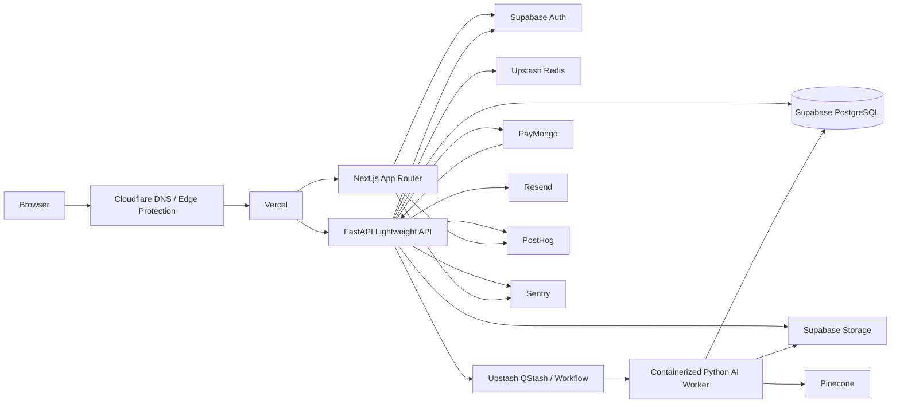
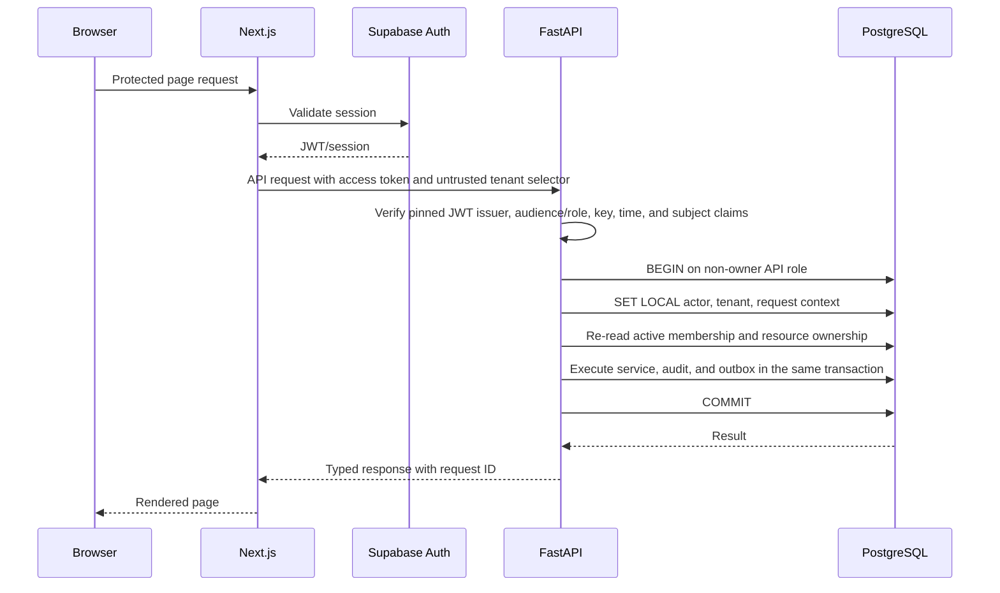

# Architecture Overview

Status: **approved architecture direction; implementation/runtime evidence pending**  
Change IDs: CHG-005, CHG-029

## Architecture style

Use a **modular monolith with independently deployable process types**. Domain data and transactions stay in one PostgreSQL database while the web, API, internal admin, orchestration, and heavy workers scale independently.

This avoids premature microservices while preserving clear boundaries that can later be extracted.

## System topology

The diagram is the long-term integration topology, not the initial deployment manifest. PayMongo, QStash, Pinecone, AI providers, browser analytics, and AI worker flows remain disabled until their documented gates close. Initial core browser traffic uses Supabase Auth and constrained signed Storage operations; core LMS data goes through the API.



## Process responsibilities

### Next.js web

- Public marketing and tenant-private course catalog
- Authentication UI and Supabase session handling
- Student, instructor, tenant, and platform dashboards
- Server Components for protected data reads
- Client Components only for interactive boundaries
- Typed calls to the FastAPI OpenAPI client
- PostHog browser analytics only after a versioned event allowlist; autocapture and replay are off by default
- Sentry browser and server instrumentation

### FastAPI API

- Authentication token verification
- Tenant resolution and membership checks
- REST endpoints and OpenAPI schema
- Application-service invocation
- Signed upload and download initiation
- Webhook endpoints only for separately enabled providers (Resend first; PayMongo deferred)
- Deferred lightweight chat streaming/orchestration endpoints only after AI gates close
- Rate-limit enforcement and request tracing

### Django domain and administration layer

- Django ORM models
- Django migrations
- Transactions and domain services
- Internal Django Admin for trusted platform operators
- Management commands
- Reusable selectors, policies, and application services
- Shared code imported by FastAPI and workers

### Dedicated Python worker

Required in principle for enabled operations that exceed normal serverless limits or require large native dependencies. The provider is still open under D-023/D-024, and deferred OCR/AI capabilities do not ship merely because they are listed here:

- Transactional outbox/email dispatch and maintenance when they cannot use a bounded approved runtime
- PDF and image parsing
- OCR
- Table and layout extraction
- EPUB and DOCX normalization
- Chunking and embedding
- Pinecone indexing
- AI blueprint generation
- Lesson and assessment generation
- Report and certificate generation
- Large exports
- Virus-scanning integration

### Supabase

- PostgreSQL source of truth
- Supabase Auth
- Supabase Storage
- RLS defense in depth
- Realtime disabled and unexposed unless a feature ADR, tenant authorization matrix, capacity test, and privacy review approve it

### Upstash

- Redis cache
- Tenant-aware rate-limit counters
- Distributed locks
- Short-lived state
- QStash/Workflow is only a candidate signed at-least-once wake-up plane; the database remains job authority and cross-region use requires approval

### Pinecone

- Rebuildable vector and lexical retrieval index
- One namespace per tenant
- Metadata filters for course, source, locale, status, and access scope
- No authoritative business state

## Request flow



### Authoritative transaction contract (CHG-005)

1. Next.js obtains/refreshes the Supabase session but never treats browser session metadata as tenant authorization.
2. FastAPI verifies the JWT contract in document 11 and resolves the requested tenant from a server-controlled route/host mapping.
3. The service acquires one database connection using a non-owner, non-`BYPASSRLS` API role and begins one short transaction.
4. It validates UUID context values and uses transaction-local settings for actor, tenant, request and optional JIT grant. Session-scoped tenant settings are prohibited.
5. In that same transaction it re-reads active membership, entitlement, resource tenant ownership, scope, and privileged grant where applicable.
6. Domain mutation, invariant checks, audit record, idempotency reservation, and outbox insert commit atomically.
7. External calls and outbox dispatch occur after commit; retries never reopen the command without its idempotency key.
8. Missing/invalid context, a pool reset failure, or inability to re-read authorization fails closed.

## Trust boundaries

| Boundary | Trust rule |
|---|---|
| Browser → Next.js/API | Treat IDs, host, locale, role/tenant claims, feature state and hidden UI controls as untrusted. Validate shape, authenticate, rate-limit and authorize the current resource relationship. |
| Next.js → FastAPI | Next.js may refresh a session and select a tenant route, but it cannot grant tenant access. FastAPI verifies the token and the database re-establishes current membership/entitlement. |
| API/Admin/worker → PostgreSQL | Use component-specific non-owner roles, one transaction-bound connection, validated `SET LOCAL` context, scoped grants and RLS. Migrator/owner credentials never enter runtime. |
| Browser/API/worker → Storage | Private server-derived object identity and short signed operations only. Uploaded bytes remain quarantined until server hash/type/scan/parser checks pass. |
| Dispatcher → worker | A signed wake-up contains opaque job/correlation IDs. The worker claims PostgreSQL state and reauthorizes; delivery is not job authority. |
| API/worker → external provider | Use an approved adapter, minimum classified payload, timeout/idempotency and recorded region/contract. No provider call occurs inside a business transaction. |
| Provider → webhook | Capture exact raw bytes, verify signature/freshness before trust, reserve a unique inbox observation, then reduce asynchronously and reconcile. |
| Core systems → telemetry/analytics | Versioned allowlist and redaction only; telemetry never becomes authorization, grade, finance, publication or job truth. |

The shared execution-context and transaction boundary is specified in document 04. A new entrypoint, provider, direct Data API exposure, runtime role, or cross-region flow requires a threat-boundary update and tests before enablement.

## Asynchronous ingestion flow

This is a gated post-MVP flow. Document 08's rights, quarantine, scanning, byte-derived validation, stage checkpoint and takedown contracts override this compact topology; it must not be deployed while AI/source processing is disabled.

```mermaid
sequenceDiagram
    participant U as Instructor
    participant A as FastAPI
    participant S as Storage
    participant D as PostgreSQL
    participant Q as QStash/Workflow
    participant W as Python Worker
    participant P as Pinecone

    U->>A: Request upload session
    A->>D: Authorize intent; create source/upload/quarantine record
    A->>S: Create signed upload URL
    A-->>U: Signed URL
    U->>S: Upload file
    U->>A: Confirm upload reference
    A->>D: Mark byte-validation job pending
    A->>Q: Send opaque signed wake-up after commit
    Q->>W: Deliver job
    W->>S: Download private object
    W->>W: Hash/type/scan/sandbox; parse, OCR, normalize, quality gate, chunk
    W->>D: Persist stage attempts, artifacts, structure and chunks
    W->>P: Upsert non-active vector generation
    W->>D: Reconcile and atomically activate eligible generation
```

## Architecture boundaries

- Web UI never directly mutates core LMS tables.
- Browser code never reads core LMS tables through the Supabase Data API. Disable the Data API if practical; otherwise expose only a dedicated minimal schema with explicit grants and RLS. Auth and constrained signed Storage operations are the only approved direct browser Supabase boundaries.
- A request may not set tenant context on one pooled connection and execute authorized work on another.
- Runtime roles never own application objects and never receive `BYPASSRLS`.
- FastAPI never duplicates Django models.
- Pinecone IDs always map to PostgreSQL chunk IDs.
- AI generation never writes directly to published course versions.
- Analytics never controls authorization or financial state.
- External webhooks are stored before business processing.
- Every background job carries `tenant_id`, `job_id`, `correlation_id`, and an idempotency key.
- Commerce and AI edges remain hard-disabled in the initial MVP even though their future contracts are documented.
