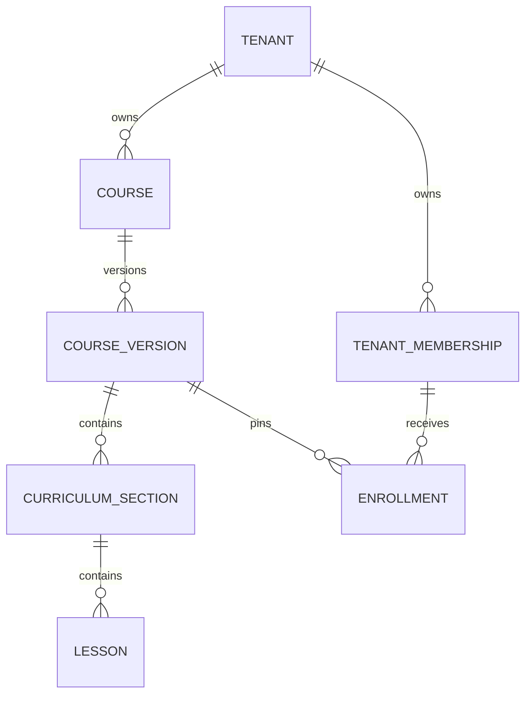

# Database Schema Plan

Status: **approved schema contract; executable migrations/data dictionary/test evidence missing**  
Change IDs: CHG-002, CHG-007, CHG-021, CHG-037, CHG-043

## Database ownership

- Supabase manages the `auth` and `storage` schemas.
- Django migrations manage `app`, `integration`, `audit`, `governance`, and `analytics` schemas.
- PostgreSQL is the authoritative system of record.
- Pinecone, PostHog, Redis, and Sentry are derived or operational stores.

## Standard columns

Mutable entities normally include:

```text
id uuid primary key
tenant_id uuid not null                 # when tenant-owned
created_at timestamptz not null
updated_at timestamptz not null
created_by_id uuid null
updated_by_id uuid null
row_version bigint not null default 1
deleted_at timestamptz null             # only when recoverable
```

Every tenant-owned table must also declare `UNIQUE (tenant_id, id)`. Every relationship between tenant-owned rows carries the parent tenant ID and uses a composite foreign key `(tenant_id, parent_id) REFERENCES parent(tenant_id, id)`. A global UUID alone is not sufficient tenant-integrity enforcement.

## Data conventions

- UUIDs for externally visible identifiers.
- UTC `timestamptz` values.
- Money in integer minor units plus ISO currency code.
- Lowercase text statuses protected by database checks.
- Tenant-aware unique constraints such as `(tenant_id, slug)`.
- Foreign-key indexes on every commonly joined relationship.
- Financial, audit, webhook, and grade-history records are append-only.
- Course versions, question versions, and source-document versions are immutable after publication or use.

## Scope catalog (not an executable data dictionary)

The names below inventory long-term scope. They do **not** authorize a migration. Initial-MVP migrations include only identity/tenancy, manual course/version/publication, enrollment/progress, basic quiz, audit/outbox and the minimum supporting tables mapped to phases 0–4 in document 20. Commerce, payouts, live-provider integration and every AI table remain absent or unreachable until their gates close.

### Mandatory executable data dictionary (CHG-002)

Before a table enters a migration, add a generated/versioned row set containing:

| Required field | Contract |
|---|---|
| Identity and ownership | Schema/table, domain owner, launch/deferred phase, authoritative service, tenant-owned/global classification |
| Columns | Name, PostgreSQL type, nullability, default, generated/immutable behavior, classification and retention reference |
| Keys | Primary key plus `UNIQUE (tenant_id,id)` for every tenant-owned table |
| Relationships | Cardinality, composite same-tenant FK, deferrability, delete/update behavior and indexed access path |
| Invariants | Named check/unique/exclusion/constraint-trigger/state-transition rules |
| Access | Runtime roles/grants, RLS policies/helpers, `FORCE RLS` decision and API exposure |
| Performance | Index name/columns/predicate, expected workload/query, threshold and production-shaped `EXPLAIN` evidence |
| Lifecycle | Insert/update/delete owner, immutability point, retention/legal-hold row in document 25 and partition/archive rule |
| Verification | Migration ID, model path, schema diagram node and invariant/RLS/rollback test IDs |

No `TBD`, unindexed FK, tenant-owned single-column FK, owner/bypass runtime role, or undocumented delete behavior may pass the migration gate.



Every tenant-owned edge in the generated physical ERD represents a composite `(tenant_id, id)` relationship even when the conceptual diagram omits repeated labels.

## Identity

- `user_profiles`
- `user_preferences`
- `user_addresses`
- `student_profiles`
- `instructor_profiles`
- `instructor_skills`
- `instructor_applications`
- `user_consents`

## Tenancy and organization

- `tenants`
- `tenant_domains`
- `tenant_branding`
- `tenant_settings`
- `tenant_feature_overrides`
- `tenant_onboarding_runs`
- `tenant_onboarding_steps`
- `tenant_contracts`
- `entitlement_periods`
- `branches`
- `departments`
- `programs`
- `academic_periods`
- `tenant_groups`
- `tenant_memberships`
- `group_memberships`
- `roles`
- `permissions`
- `role_permissions`
- `membership_roles`
- `membership_scopes`
- `tenant_invitations`
- `privileged_access_requests`
- `privileged_access_approvals`
- `privileged_access_grants`
- `custom_domain_challenges`
- `custom_domain_events`

## Assets

- `assets`
- `asset_variants`
- `asset_access_grants`
- `storage_objects`
- `storage_scan_results`

## Catalog and courses

- `course_categories`
- `course_category_translations`
- `course_tags`
- `courses`
- `course_versions`
- `course_translations`
- `course_instructors`
- `course_tag_links`
- `course_text_items`
- `course_relations`
- `course_offerings`
- `offering_instructors`
- `course_publication_reviews`

## Curriculum

- `curriculum_sections`
- `curriculum_section_translations`
- `lessons`
- `lesson_translations`
- `lesson_content_blocks`
- `lesson_assets`
- `lesson_relations`

## Learning

- `enrollment_rules`
- `enrollments`
- `enrollment_events`
- `learning_paths`
- `learning_path_translations`
- `learning_path_courses`
- `learning_path_assignments`
- `course_progress`
- `section_progress`
- `lesson_progress`
- `learning_sessions`
- `lesson_notes`
- `lesson_bookmarks`

## Assessments

- `question_banks`
- `questions`
- `question_versions`
- `question_translations`
- `question_options`
- `question_option_translations`
- `question_tag_links`
- `quizzes`
- `quiz_translations`
- `quiz_sections`
- `quiz_questions`
- `quiz_attempts`
- `quiz_attempt_questions`
- `quiz_attempt_answers`
- `quiz_answer_selections`
- `quiz_answer_assets`

## Assignments and grading

- `assignments`
- `assignment_translations`
- `assignment_rubrics`
- `rubric_criteria`
- `rubric_criterion_translations`
- `assignment_submissions`
- `assignment_submission_assets`
- `assignment_grades`
- `assignment_rubric_scores`
- `gradebook_items`
- `gradebook_entries`
- `final_grades`

## Live classes

- `live_sessions`
- `live_session_attendance`
- `live_session_recordings`

## Certificates

- `certificate_templates`
- `certificate_template_translations`
- `certificate_rules`
- `certificates`

## Commerce

- `products`
- `product_prices`
- `carts`
- `cart_items`
- `promotions`
- `coupon_codes`
- `coupon_redemptions`
- `orders`
- `order_items`
- `order_adjustments`

## Payments and subscriptions

**Deferred:** no initial-MVP migrations, routes, credentials, or provider jobs. The catalog below is future scope only.

- `billing_profiles`
- `payment_customers`
- `payment_methods`
- `checkout_attempts`
- `payment_attempts`
- `provider_payment_facts`
- `refund_requests`
- `provider_refunds`
- `refund_allocations`
- `payment_disputes`
- `subscription_plans`
- `plan_prices`
- `plan_features`
- `commercial_subscriptions`
- `provider_subscriptions`
- `subscription_usage_records`
- `invoices`
- `invoice_items`
- `settlements`
- `settlement_lines`

## Ledger and payouts

**Deferred:** no initial-MVP money movement or instructor payout. Any future implementation must use the financial contract below.

- `ledger_accounts`
- `ledger_transactions`
- `ledger_entries`
- `instructor_earnings`
- `payout_accounts`
- `payout_requests`
- `payouts`
- `payout_items`

### Future financial integrity contract (CHG-007)

Before paid commerce is enabled, replace the scope names with an executable dictionary separating:

- provider event inbox and raw-body hash/signature admission;
- local command/idempotency reservation and checkout/payment attempts;
- normalized provider customer/payment/subscription facts;
- order and immutable entitlement periods independent of provider state;
- refund requests, provider refunds, allocations, disputes and settlement facts;
- optional linked-account/payout onboarding and payout allocations;
- append-only ledger transactions and entries with account, side, integer minor amount and ISO currency.

Provider/environment event and object IDs are unique. Allowed state transitions use named checks/services. A deferred constraint trigger proves debits equal credits per currency before commit. Corrections are compensating entries, never updates/deletes. The accepted provider event, state reduction, balanced ledger, entitlement change and outbox commit atomically. Q-05, account capability proof and the exact contract in document 17 are non-waivable gates.

## Communication

- `announcements`
- `announcement_targets`
- `announcement_reads`
- `conversations`
- `conversation_members`
- `messages`
- `message_assets`
- `discussion_threads`
- `discussion_posts`
- `notifications`
- `notification_deliveries`
- `notification_preferences`
- `message_templates`
- `message_template_translations`

## Engagement and support

- `reviews`
- `review_reports`
- `wishlist_items`
- `referral_programs`
- `referral_codes`
- `referral_conversions`
- `referral_rewards`
- `support_categories`
- `support_tickets`
- `support_ticket_messages`
- `support_ticket_assets`

## Localization and CMS

- `languages`
- `currencies`
- `tenant_locales`
- `translation_keys`
- `translation_values`
- `cms_entries`
- `cms_entry_translations`
- `contact_submissions`
- `newsletter_subscriptions`
- `platform_settings`
- `feature_flags`

## Integration, audit, analytics

- `integration.connections`
- `integration.provider_event_inbox`
- `integration.idempotency_records`
- `integration.outbox_messages`
- `integration.consumer_event_inbox`
- `integration.webhook_endpoints`
- `integration.webhook_deliveries`
- `integration.api_keys`
- `integration.jobs`
- `integration.job_attempts`
- `integration.job_artifacts`
- `audit.audit_logs`
- `audit.security_events`
- `audit.privileged_access_events`
- `audit.break_glass_events`
- `audit.data_export_requests`
- `analytics.events`
- `analytics.daily_tenant_metrics`
- `analytics.daily_course_metrics`
- `analytics.report_exports`
- `analytics.scheduled_reports`

## Governance and data lifecycle

- `governance.retention_policies`
- `governance.legal_holds`
- `governance.legal_hold_scopes`
- `governance.deletion_requests`
- `governance.deletion_jobs`
- `governance.deletion_job_items`
- `governance.data_subject_request_events`
- `governance.processing_activity_versions`
- `governance.transfer_approval_versions`

Documents 25/26 own the approved values and workflow. These rows coordinate policy/evidence; they do not invent a legal basis or retention period.


## High-value constraints

- One active membership for each tenant and user.
- One active enrollment for each user and course offering.
- One primary domain for each tenant.
- One published version for each course.
- Published course versions are immutable.
- Quiz attempts retain the exact question-version snapshot.
- Refund totals cannot exceed the settled payment.
- Ledger debits equal ledger credits.
- Provider webhook, payment, refund, and payout IDs are unique.
- Certificate number is unique within a tenant.
- Percentages are between 0 and 100.
- End timestamps are after start timestamps.
- Every tenant-owned child/parent pair has a composite same-tenant FK and negative migration test.
- An enrollment pins one immutable course version; publication pointer changes cannot rewrite existing enrollment history.
- Tenant access requires an active local entitlement period; provider redirects or billing state never grant access directly.
- Runtime transitions use compare-and-swap/row version or an explicit lock and reject stale writes.

## State and deletion contract

Every persisted status has one canonical lowercase value set in the executable dictionary. For each value set, the owning domain supplies an allowed-transition table containing source state, target state, actor/service, guards, concurrent-write rule, audit/outbox fact and positive/negative test ID. Application enums are generated or checked against the migration definition; aliases and free-form provider states are prohibited. Provider states remain normalized observations and never share a column with local domain state.

Deletion behavior is explicit per relationship:

| Data class | Default behavior |
|---|---|
| Tenant identity and tenant-owned parent links | Tenant ID is immutable. Use composite FKs and `RESTRICT` unless an approved deletion coordinator orders children safely. |
| Recoverable editable draft | A documented `deleted_at`/tombstone may hide it; restore and uniqueness behavior must be tested. Soft delete is not a universal default. |
| Published/versioned learning content | Immutable version plus withdrawal/archive; never update or cascade-delete enrollment-pinned history. |
| Attempts, grade history, audit, security and future finance journals | Append-only for the approved retention period; corrections are new facts. |
| Contained ephemeral child with no independent retention/hold value | `CASCADE` is allowed only when the dictionary names it and deletion/hold tests prove the boundary. |
| Personal/source/provider data subject to erasure or rights invalidation | Durable deletion/impact job traverses every relational, object, cache, vector, telemetry, provider and backup edge under documents 25/26. |

A legal hold blocks deletion/anonymization only for its approved scope and never silently restores access. A restored backup immediately replays active deletion/right tombstones before traffic. No hard delete ships without its retention row, hold behavior, downstream impact, recovery consequence and owner approval.

## Custom-domain lifecycle (CHG-021)

`tenant_domains.normalized_hostname` is globally unique after IDNA/case/trailing-dot normalization. Cloudflare for SaaS is the single certificate/hostname authority unless a new ADR replaces it.

```text
requested -> ownership_verified -> certificate_active -> routable
         -> suspended -> removed
```

Store ownership-validation and certificate states separately, provider hostname ID, verification evidence, last revalidation, routing target, failure reason, suspension/removal timestamps and audit actor. Routing requires active tenant + entitlement + ownership + certificate. Churn or failed revalidation removes the provider hostname and cache entry; the platform domain remains the fallback. Host cache keys include environment and normalized hostname, and tests cover collisions, stale cache, removal/reclaim and wrong-tenant routing.

## Required views

Only views needed by an enabled phase are created. Initial scope is limited to core membership, published manual-course catalog and learner/instructor views; finance views stay absent until commerce is enabled.

- `effective_membership_permissions`
- `published_course_catalog`
- `student_course_dashboard`
- `certificate_verification_view`
- `instructor_earnings_summary` — deferred with payouts
- `order_payment_summary` — deferred with commerce

Views do not bypass table protection. Exposed views use `security_invoker` where supported and retain underlying RLS/grants. Any `SECURITY DEFINER` helper has a fixed safe `search_path`, reviewed non-runtime owner, least-privilege body, explicit input validation, and `PUBLIC EXECUTE` revoked.

## RLS strategy

Every tenant-owned application table enables and forces RLS, including tables not exposed through the Data API. Runtime requests/tasks set validated transaction-local values:

```sql
select set_config('app.current_actor_type', :actor_type, true);
select set_config('app.current_actor_id', :actor_id, true);
select set_config('app.current_tenant_id', :tenant_id, true);
select set_config('app.current_request_id', :request_or_job_id, true);
```

Helper functions:

```text
app.current_actor_type()
app.current_actor_id()
app.current_tenant_id()
app.is_tenant_member(tenant_id)
app.has_permission(tenant_id, permission_key)
app.has_scoped_permission(tenant_id, permission_key, scope_type, scope_id)
app.has_service_job_scope(tenant_id, job_id, stage_or_permission)
```

User policies re-read active membership/entitlement. Worker/reconciler policies require a registered service actor plus a currently claimed tenant/job/stage scope; an initiating user ID in a job is audit lineage and never grants service access. Application policy checks remain mandatory even when RLS exists.

`FORCE ROW LEVEL SECURITY` is the default and approved decision for tenant-owned application tables. Non-tenant global reference tables must be explicitly classified and least-granted. Any table that cannot use forced RLS is a P0 security exception with owner, reason, alternate isolation, expiry and negative tests; no runtime owner or `BYPASSRLS` role is an exception mechanism.

### Policy, role, and index evidence (CHG-037)

For each table, the executable dictionary pairs every `USING`/`WITH CHECK` predicate and helper lookup with its exact index and a production-shaped `EXPLAIN (ANALYZE, BUFFERS)` test. Tests run as API, worker, reconciler, analytics and JIT-support roles—not owner/migrator—and cover absent context, stale membership, wrong tenant, guessed ID, insert/update tenant change, view access and pool reuse. Policy helpers re-read active membership; they do not trust user-editable JWT metadata.

Core tables are not exposed through the Data API. If the platform cannot disable it, only a dedicated minimal API schema is exposed, with default privileges revoked and an explicit allowlist.

## Retention, archive, and partition decisions (CHG-043)

Document 25 owns retention and legal-hold periods. The data dictionary records estimated rows/day, bytes/month, primary queries, deletion pattern and hold behavior for webhook/inbox/outbox, job, audit, security, usage and analytics events.

- Do not partition per tenant by default.
- Prefer bounded retention, archival and appropriate indexes before partitioning.
- Introduce time partitioning only after measured size/maintenance/query thresholds and a benchmark justify it.
- The ADR/migration must address cross-partition uniqueness, idempotency keys, foreign keys, late events, legal holds, detach/archive, restore and rollback.
- A partition is never dropped while an applicable hold exists.

## Migration plan

Initial private-LMS sequence:

1. Create approved extensions and application schemas.
2. Create non-login owners, migrator/runtime roles and default-deny grants.
3. Create minimum identity, tenancy, local-entitlement and organization tables.
4. Create RLS helpers, production-role policies, audit, idempotency and outbox/inbox tables with fail-closed tests.
5. Create minimum assets, catalog, immutable course/curriculum/review/publication tables.
6. Create enrollment, progress and basic-assessment tables.
7. Create only the communication/notification and operational tables required by enabled MVP flows.
8. Create approved views and all predicate/FK/query indexes, then run the production-role matrix and schema fingerprint/drift checks.
9. Seed only stable platform roles, permissions and required locale reference data using deterministic synthetic identifiers.

Gated later sequences are separate migration groups: assignments/gradebook/certificates; custom domains; commerce/financials; source/document ingestion; AI generation/evaluation; and RAG/vector/chat. A deferred catalog name is never included merely to “prepare” the schema. Its decision, dictionary, threat model, retention classification, workload and tests must be approved first.

Use expand-and-contract migrations for production changes. Never perform a large backfill in a deployment transaction.

Django migrations and `RunSQL` are the sole authority for application DDL, RLS, grants, helpers, triggers, extensions and bucket metadata. The Supabase CLI may provision/test local or branch platform configuration but must not create a parallel application migration history. Every migration records a schema fingerprint, generated ERD/data-dictionary update, forward/rollback or roll-forward plan, lock/statement timeout, role used and invariant-test evidence.
